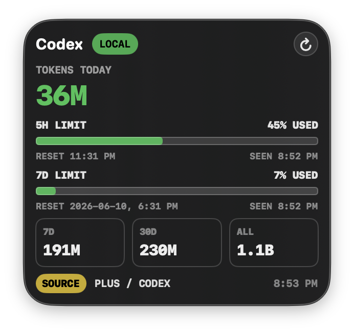

# Codex Usage Monitor

A local macOS desktop widget and menu-bar app for tracking Codex token usage from the Codex files already on your Mac.

[](https://github.com/JJ9276489/codex-usage-monitor/actions/workflows/ci.yml)



## What It Shows

- Tokens used today, in the last 5 hours, last 7 days, and last 30 days
- All-time local token total reconciled from Codex's local state database and session logs
- Latest observed 5-hour and 7-day Codex rate-limit percentages
- Reset times for both the 5-hour and 7-day limits
- Local diagnostics: session file count, `token_count` event count, and partial-data warnings
- Recent local Codex threads in the menu bar popover

The app is local-only. It does not call OpenAI APIs, does not read `auth.json`, does not read access tokens, and does not transmit usage data.

## Requirements

- macOS 14 or newer
- Swift toolchain from Xcode or Xcode Command Line Tools
- Codex used locally on the same Mac
- Local Codex data under `~/.codex`, or a custom `CODEX_HOME`

This project does not ship a signed or notarized binary yet. The supported public path is to clone, build, and run locally.

## Quick Start

```bash
git clone https://github.com/JJ9276489/codex-usage-monitor.git
cd codex-usage-monitor
./script/doctor.sh --build
./script/build_and_run.sh
```

## Install At Login

```bash
./script/install_login_item.sh
```

This builds the app, copies it to `~/Applications/CodexUsageMonitor.app`, and registers a user LaunchAgent:

```text
~/Library/LaunchAgents/io.github.jj9276489.codex-usage-monitor.plist
```

To remove the installed app and login item:

```bash
./script/uninstall.sh
```

Custom Codex paths are preserved in the LaunchAgent when provided at install time:

```bash
CODEX_HOME=/path/to/.codex ./script/install_login_item.sh
CODEX_USAGE_DB=/path/to/state_5.sqlite ./script/install_login_item.sh
CODEX_LOGS_DB=/path/to/logs_2.sqlite ./script/install_login_item.sh
```

## Accuracy Model

Rolling totals come from local Codex session JSONL `token_count` events:

- `~/.codex/sessions/**/*.jsonl`
- `~/.codex/archived_sessions/*.jsonl`

The reader uses exact `last_token_usage.total_tokens` for the first observed event in a session, then positive deltas between consecutive cumulative `total_token_usage.total_tokens` values. It ignores repeated rate-limit-only events and ignores empty limit payloads that do not include a real primary or secondary window.

All-time totals use `state_5.sqlite` as the baseline, then correct individual sessions upward when the matching JSONL file contains a newer cumulative total:

```text
~/.codex/state_5.sqlite
~/.codex/sessions/**/*.jsonl
~/.codex/archived_sessions/*.jsonl
```

Rate-limit percentages and reset times come from the newest usable local rate-limit payload in session JSONL or Codex logs.

More detail: [docs/ACCURACY.md](docs/ACCURACY.md)

## Audit And Verify

Compare the widget to raw local Codex data:

```bash
./script/audit_usage.py
./script/audit_usage.py --json
```

Run local checks:

```bash
./script/test_usage_accuracy.py
./script/test_swift_usage_reader.sh
./script/build_and_run.sh --build-only
```

Run environment diagnostics:

```bash
./script/doctor.sh
./script/doctor.sh --build
```

## Development

```bash
./script/build_and_run.sh
./script/build_and_run.sh --verify
./script/build_and_run.sh --logs
./script/build_and_run.sh --telemetry
./script/build_and_run.sh --debug
```

If SwiftPM fails before compiling source with a PackageDescription or SDK mismatch, the run script falls back to direct `swiftc` compilation. For a long-term local SwiftPM fix, update or reinstall Xcode Command Line Tools, or install full Xcode and select it:

```bash
sudo xcode-select -s /Applications/Xcode.app/Contents/Developer
```

## Troubleshooting

Start with:

```bash
./script/doctor.sh
./script/audit_usage.py
```

Common cases are covered in [docs/TROUBLESHOOTING.md](docs/TROUBLESHOOTING.md).

## Compatibility

This project depends on Codex's local session JSONL and SQLite formats. Those are not a public stability contract. If a future Codex release changes `token_count` event shape, the app may show partial data or zeros until the reader is updated.

The widget will not work for browser-only ChatGPT usage, non-macOS systems, or machines without local Codex session files.

## Security And Privacy

See [SECURITY.md](SECURITY.md).

## Roadmap

- Signed and notarized release builds
- Optional WidgetKit extension if a stable usage feed becomes available
- Better first-run onboarding for missing Codex data
- Stable API-backed provider if OpenAI exposes official personal usage/remaining-limit endpoints

## License

MIT
